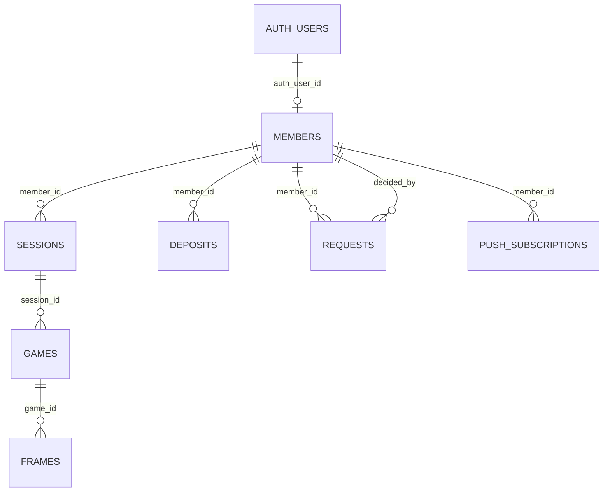

# データベース構造

この文書は、OMB（大島マンデーボウリング）がSupabaseに保存しているデータの構造をまとめたものです。

> [!IMPORTANT]
> このリポジトリには、データベース全体を最初から作る完全なマイグレーションがまだありません。以下は、現在のJavaScript、Edge Function、既存マイグレーションから確認できる構造です。型、初期値、制約、RLSの最終的な正解は、Supabase Dashboardの **Table Editor** と **Database** で確認してください。

## 全体像



主な流れは次のとおりです。

1. ログイン情報はSupabase Authの `auth.users` に保存されます。
2. アプリ内の人物情報は `members` に保存され、`auth_user_id` でログイン情報と結び付きます。
3. 1回の参加記録を `sessions`、各ゲームを `games`、各フレームを `frames` に分けて保存します。
4. 回数券の増減は `deposits`、メンバーからの申請は `requests` に保存します。

## テーブル一覧

### `members` — メンバー

| カラム | 内容 | 備考 |
|---|---|---|
| `id` | メンバーID | UUIDと考えられる。各テーブルから参照される |
| `name` | 表示名 | 管理者が追加・変更する |
| `status` | 在籍状態 | アプリで使用する値は `在籍` / `退会` |
| `role` | 権限 | `admin` の場合は管理者 |
| `auth_user_id` | Supabase AuthのユーザーID | `auth.users.id` と結び付ける |
| `avatar` | アバター | 絵文字またはStorage上の画像URL |
| `equipped_achievement` | 装備中の称号ID | 称号定義自体はJavaScript内にある |

関連処理：`link_my_account`、`set_member_avatar`、`set_member_equipped_achievement`。

削除操作は行の物理削除ではなく、現在は `status = '退会'` に変更する方式です。

### `sessions` — 参加・投球記録

| カラム | 内容 | 備考 |
|---|---|---|
| `id` | セッションID | `games.session_id` から参照される |
| `member_id` | 投球したメンバー | `members.id` を参照 |
| `date` | 実施日 | 日付文字列として利用 |
| `game_count` | 投球ゲーム数 | 1〜5ゲームを想定 |
| `created_at` | 作成日時 | 同日の並び順にも使用 |
| `updated_at` | 更新日時 | 編集時に更新 |

同じメンバー・同じ日付の重複登録は、DBの一意制約で防いでいる前提です。コードは重複時のPostgreSQLエラー `23505` を処理します。

### `games` — 1ゲームの得点

| カラム | 内容 | 備考 |
|---|---|---|
| `id` | ゲームID | `frames.game_id` から参照される |
| `session_id` | 所属するセッション | `sessions.id` を参照 |
| `game_number` | 何ゲーム目か | 1〜5 |
| `score` | ゲーム合計点 | ボウリングでは通常0〜300 |

`sessions` を削除すると、関連する `games` も `ON DELETE CASCADE` で削除される前提です。

### `frames` — フレーム詳細

| カラム | 内容 | 備考 |
|---|---|---|
| `game_id` | 所属するゲーム | `games.id` を参照 |
| `frame_number` | フレーム番号 | 1〜10 |
| `throws` | 各投球の記録 | 配列。JSON/JSONB型と考えられる |
| `score` | そのフレームまでの累計点 | 未確定時は `null` |
| `is_split` | スプリットか | boolean |

フレームの `score` はフレーム単体の点ではなく、スコアシートに表示される累計点として扱われます。

### `deposits` — 回数券の増減履歴

| カラム | 内容 | 備考 |
|---|---|---|
| `id` | 履歴ID | 既存記録の編集に使用 |
| `member_id` | 対象メンバー | `members.id` を参照 |
| `date` | 記録日 |  |
| `packs` | 回数券の冊数 | 購入は正、返還などは負の整数 |
| `note` | 備考 | 空の場合は `null` |
| `created_at` | 作成日時 | 同日の並び順にも使用 |

残りゲーム数は保存せず、次の式で画面表示時に計算します。

```text
残りゲーム数 = 回数券の合計冊数 × 1冊あたりのゲーム数 - 投球済みゲーム数
```

### `app_settings` — アプリ共通設定

| カラム | 内容 | 備考 |
|---|---|---|
| `id` | 設定ID | アプリは常に `id = 1` を読む |
| `price_per_pack` | 回数券1冊の価格 | 未取得時の画面側初期値は3000円 |
| `games_per_pack` | 1冊で投げられるゲーム数 | 未取得時の画面側初期値は11 |
| `updated_at` | 更新日時 | 設定変更時に更新 |

### `requests` — 承認申請

スコア登録、回数券購入、退会時返還の申請を1つのテーブルで管理します。

| カラム | 内容 | 備考 |
|---|---|---|
| `id` | 申請ID |  |
| `member_id` | 申請者 | `members.id` を参照 |
| `type` | 申請種別 | `score` / `purchase` / `return` |
| `status` | 状態 | `pending` / `approved` / `rejected` |
| `date` | 対象日 | スコア実施日または申請日 |
| `games` | 申請するゲーム内容 | スコア申請時に使用するJSON配列 |
| `source` | 入力元 | 写真読取では `photo` |
| `packs` | 回数券の冊数 | 購入・返還時。正の整数 |
| `payment_method` | 支払方法 | `cash` / `ticket` / `null` |
| `note` | 備考 |  |
| `reject_reason` | 却下理由 | 却下時のみ |
| `decided_at` | 承認・却下日時 |  |
| `decided_by` | 判断した管理者 | `members.id` を参照すると考えられる |
| `created_at` | 作成日時 |  |

`games` の保存例：

```json
[
  {
    "game_number": 1,
    "score": 180,
    "frames": [
      { "throws": ["X"], "score": 20, "is_split": false }
    ]
  }
]
```

### `push_subscriptions` — Web Push購読情報

| カラム | 型 | 内容 |
|---|---|---|
| `id` | `uuid` | 主キー。自動生成 |
| `member_id` | `uuid` | `members.id` を参照。メンバー削除時は連動削除 |
| `endpoint` | `text` | PushサービスのURL。一意 |
| `p256dh` | `text` | Push暗号化用の公開鍵 |
| `auth` | `text` | Push暗号化用の認証情報 |
| `user_agent` | `text` | 登録したブラウザ情報 |
| `created_at` | `timestamptz` | 作成日時 |
| `updated_at` | `timestamptz` | 更新日時 |

このテーブルの定義は `supabase/migrations/202607310001_requests_and_push.sql` にあります。同じ端末の再登録は `endpoint` をキーにupsertします。無効になった購読は通知処理が削除します。

## DBに保存しないデータ

- 称号の種類と獲得条件は `js/app.js` の `ACHIEVEMENTS` に定義されています。
- 平均、ハイスコア、ランキング、残りゲーム数などの集計値は、取得したデータからブラウザで計算します。
- Gemini APIキーはDBやブラウザには保存せず、Supabase Edge FunctionのSecretとして管理します。
- アバター画像本体はSupabase Storageの `avatars` バケットに保存し、`members.avatar` には公開URLを保存します。

## RPC（データベース関数）

| 関数 | 用途 |
|---|---|
| `link_my_account` | ログイン中のAuthユーザーをメンバーに関連付ける |
| `set_member_avatar` | 対象メンバーのアバターを変更する |
| `set_member_equipped_achievement` | 対象メンバーの装備中称号を変更する |

これらのSQL定義は現在リポジトリにないため、Supabase Dashboardで確認する必要があります。

## RLSと権限

RLS（Row Level Security）は、ブラウザからSupabaseへ直接接続するこのアプリの重要な防御です。

- 通常メンバー：自分のプロフィール、申請、Push購読など、必要な範囲だけ操作できるようにする。
- 管理者：スコア、回数券、メンバー、設定、申請結果を管理できるようにする。
- `push_subscriptions`：ログイン中のAuthユーザーに結び付いた、自分自身の購読だけ操作できるポリシーがマイグレーションに記録されています。
- Edge FunctionでService Roleを使う処理はRLSを迂回できるため、関数内でログイン状態と `members.role` を必ず検査します。

RLSを変更するときは、管理者アカウントだけでなく通常メンバーでも「読めるもの・書けるもの」を確認してください。

## 削除済み・使用しないテーブル

次のテーブルは現在のアプリでは使用せず、Supabaseから削除済みです。再作成は不要です。

- `session_totals`
- `pending_scans`
- `member_achievements`

## 構造を変更するときの手順

1. Supabase Dashboardで直接変更する前に、変更内容をSQLマイグレーションとして `supabase/migrations/` に追加する。
2. 外部キー、`NOT NULL`、初期値、CHECK制約、インデックス、RLSポリシーへの影響を確認する。
3. `js/data.js` の読込・保存処理と、`js/requests.js` の申請処理を確認する。
4. Edge Functionが対象テーブルを参照していないか確認する。
5. 管理者と通常メンバーの両方で操作テストをする。
6. PWAのキャッシュ対象ファイルを変えた場合は、`sw.js` のキャッシュバージョンも更新する。
7. この文書も同じコミットで更新する。

特にカラム名の変更や削除は、先に新カラムを追加してデータを移し、コードを切り替えてから旧カラムを削除する段階的な変更が安全です。

## 今後追加したいもの

現在のデータベースを確実に再現できるよう、Supabaseに存在する以下の定義をマイグレーションとしてリポジトリへ追加するのが次の課題です。

- 基本7テーブル（`members`、`sessions`、`games`、`frames`、`deposits`、`app_settings`、`requests`）のCREATE文
- 外部キー、一意制約、CHECK制約、インデックス
- 全テーブルのRLSポリシー
- 3つのRPC関数
- `avatars` StorageバケットとStorageポリシー
